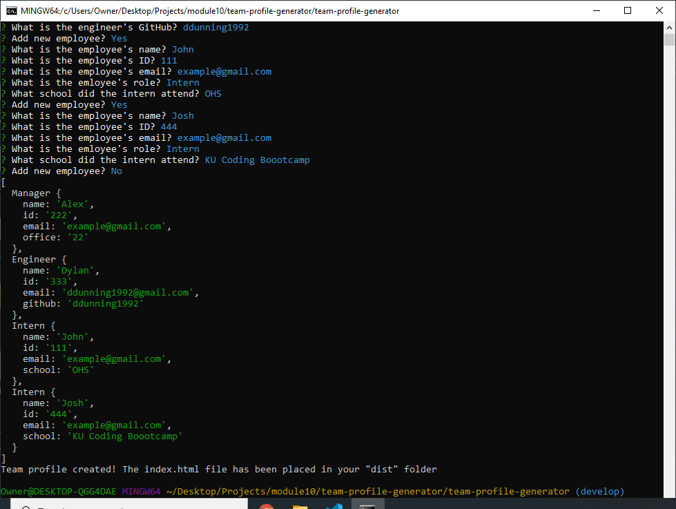

# Team Profile Generator

## Project Description
This application takes user input in the form of employee information, then generates a static html/css website to display the information.
    
## Table of Contents
* [Installation](#installation)
* [Usage](#usage)
* [Screenshots](#screenshots)
* [Questions](#questions)
    
## Installation
Copy the application files into the folder of your choice. Open the command line at the root directory and type "npm init". Then type "npm install inquirer". After it is done installing, the application is ready to use.
    
## Usage
Open the command line at the root directory. Type "node index.js" then follow through the prompts. After it is finished, your HTML and CSS files can be found in the "dist" folder.

## Technologies
* HTML
* CSS
* Bootstrap
* JavaScript
* ES6
* Node
* NPM

## Screenshots
 
    
## Questions
For further information or questions regarding this project contact me at:
* GitHub: https://github.com/ddunning1992
* Email: ddunning1992@gmail.com
## Table of Contents
* [Installation](#installation)
* [Usage](#usage)
* [Screenshots](#screenshots)
* [Questions](#questions)